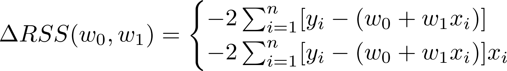
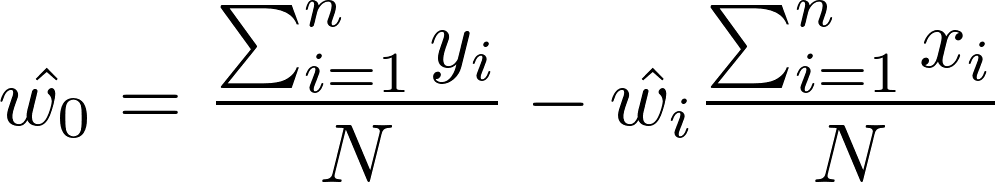
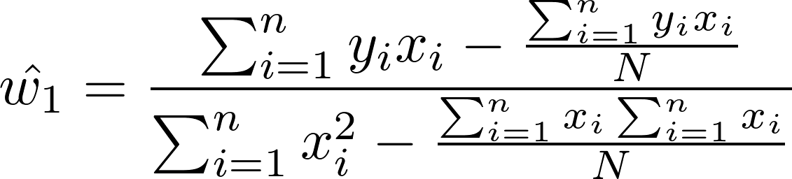
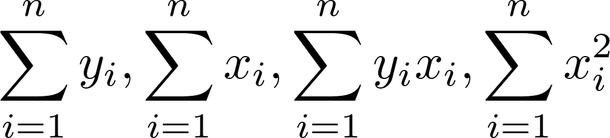

# ML_Regression

Washington University ML course at Coursera

## Week 1 formulas

Calculate w0 as follows:

Calculate w1 as follows:

## Note: you need to calculate these 4 things

# Week 4

Useful link [http://statweb.stanford.edu/~tibs/sta305files/](http://statweb.stanford.edu/~tibs/sta305files/)

